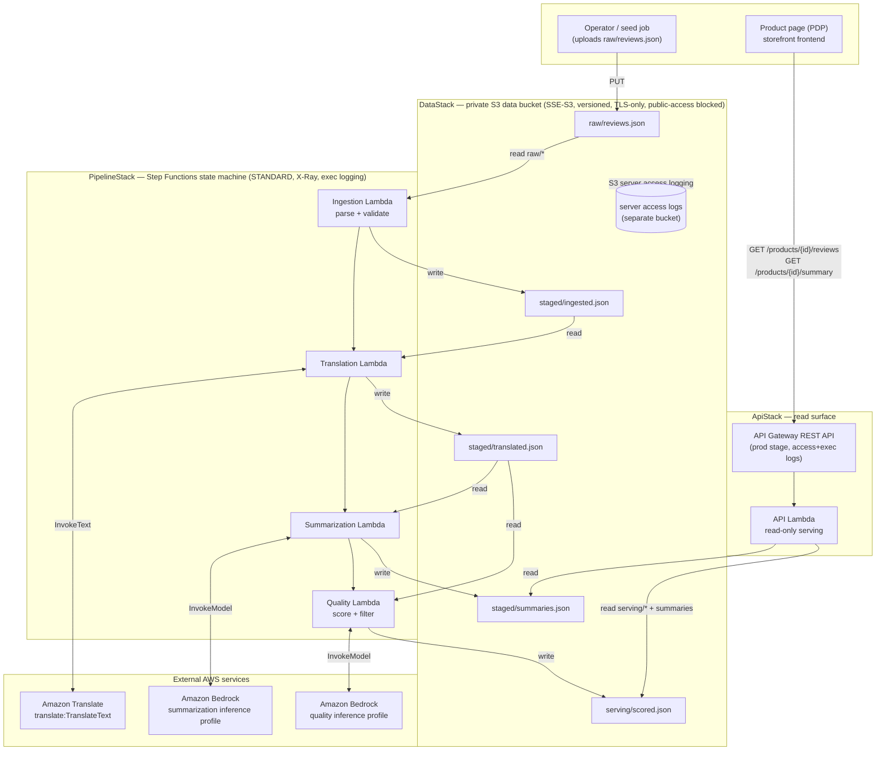

<!--
SPDX-License-Identifier: Apache-2.0
Copyright AnyCompany Apparel Review Pipeline contributors.
-->
# Architecture diagram

System view of the AnyCompany Apparel Review Pipeline. The system splits into two
independent paths over a single private S3 data bucket:

- a **batch write path** — an AWS Step Functions state machine that drives four
  single-responsibility Lambdas (ingestion → translation → summarization →
  quality), each reading and writing JSON under a distinct S3 prefix; and
- a **synchronous read path** — an API Gateway REST API backed by one read-only
  Lambda that serves the already-processed results to product pages.

The three CDK stacks (`DataStack`, `PipelineStack`, `ApiStack`) are drawn as
subgraphs. IAM is least-privilege per Lambda; the grants shown on each edge are
the *only* access that Lambda has. Rendered from `infra/stacks/*.py`.

## Least-privilege IAM summary

Each batch Lambda holds only the grants on its inbound/outbound edges above; the
read API Lambda has **no** Bedrock or Translate access.

| Lambda | S3 read | S3 write | Other |
|---|---|---|---|
| Ingestion | `raw/*` | `staged/ingested.json` | — |
| Translation | `staged/ingested.json` | `staged/translated.json` | `translate:TranslateText` |
| Summarization | `staged/translated.json` | `staged/summaries.json` | `bedrock:InvokeModel` (summarization inference-profile ARN **+ its foundation-model ARNs**) |
| Quality | `staged/translated.json` | `serving/scored.json` | `bedrock:InvokeModel` (quality inference-profile ARN **+ its foundation-model ARNs**) |
| API | `serving/*`, `staged/summaries.json` | — | — |

> **Bedrock IAM note.** The model ids are *cross-region inference profiles*
> (`us.anthropic.*`), which route to the underlying foundation model in
> us-east-1/us-east-2/us-west-2. Invoking through a profile therefore requires
> `bedrock:InvokeModel` on **both** the inference-profile ARN and those
> foundation-model ARNs — granting only the profile ARN yields a 403. The
> summarization/quality grants cover both (see
> `PipelineStack._invoke_model_statement`).

See [`docs/infra-contracts.md`](../infra-contracts.md) for the S3 object layout,
environment variables, and the full per-Lambda IAM contract, and
[`docs/adr/`](../adr/) for the decisions behind these choices.

## Evaluation harness (offline path)

Separate from the deployed system, the committed evaluation harness
([`evaluation/`](../../evaluation/)) imports the same `review_pipeline` stages
(clients injected) to measure translation quality — an LLM-as-judge score reusing
the pipeline's quality stage, plus a back-translation round-trip similarity check
— and writes `evaluation/reports/quality-report.md`. It exercises the pipeline's
*logic*, not the deployed infrastructure, so it re-runs anywhere without a live
stack. See the README **Evaluation** section.
