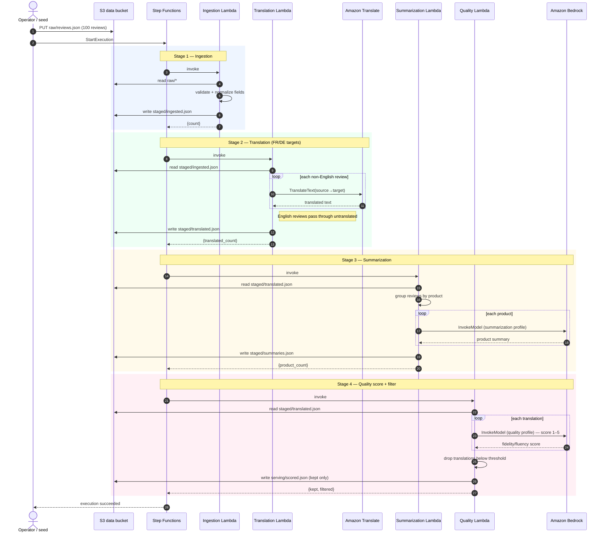
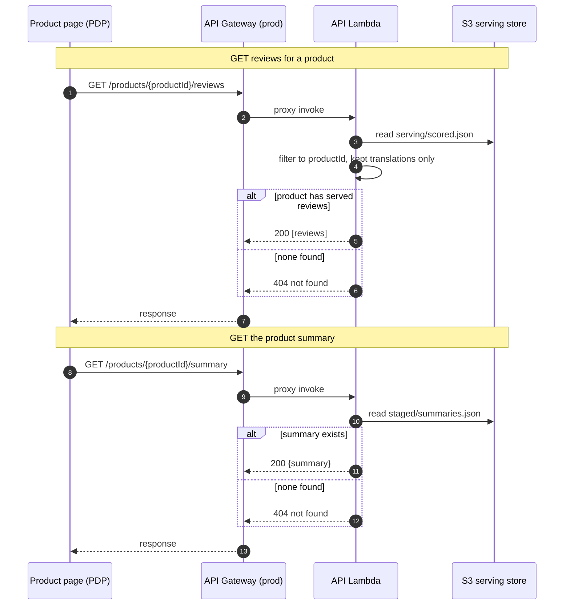

<!--
SPDX-License-Identifier: Apache-2.0
Copyright AnyCompany Apparel Review Pipeline contributors.
-->
# Sequence diagrams

Two primary use-cases, end to end:

1. **Batch processing run** (write path) — a full pipeline execution from seeded
   raw reviews to a served, quality-filtered result set.
2. **Product-page read** (read path) — a storefront fetching reviews and the
   summary for one product.

Both are drawn from the handlers (`handlers/*.py`), the Step Functions definition
(`infra/stacks/pipeline_stack.py`), and the read API (`infra/stacks/api_stack.py`).

## Use-case 1 — Batch processing run (write path)

The Step Functions state machine invokes each stage Lambda **synchronously** and
in order. Every stage reads its input object from S3 and writes its output object
back before the next stage starts. Transient faults are retried at the
state-machine level (exponential backoff, 3 attempts per task).

Failure handling: any stage that raises (e.g. an S3 read/write fault surfaces as
`S3IOError` from `handlers/s3_io.py`) is retried by the state machine; after
retries are exhausted the execution fails and no downstream stage runs, so a
partial run never publishes to the serving store.

## Use-case 2 — Product-page read (read path)

Synchronous and independent of the batch run — it only reads the serving store
that a completed batch run produced. The API Lambda has read-only S3 access and
no Bedrock/Translate permissions.

See [`architecture.md`](architecture.md) for the system view and
[`docs/infra-contracts.md`](../infra-contracts.md) for the S3 layout, handler
entry points, and per-Lambda IAM.
